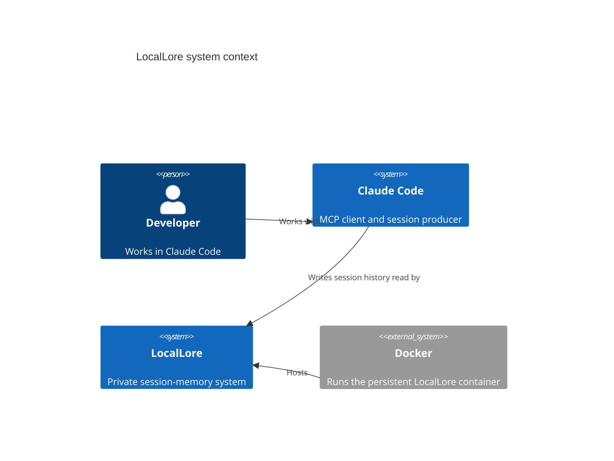
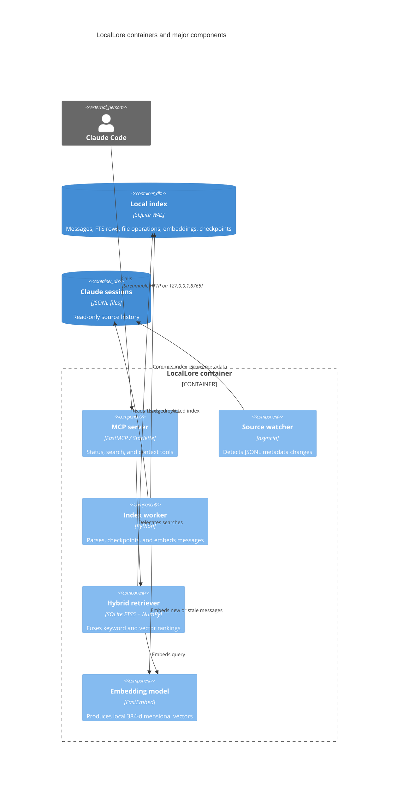

# Architecture

LocalLore is one local daemon with four responsibilities: observe session
files, maintain an index, retrieve memories, and expose those capabilities to
Claude Code through MCP.

## System context (C4 level 1)

## Containers and components (C4 levels 2–3)

## Runtime behavior

The watcher and a single indexing worker run as asynchronous background tasks.
CPU- and I/O-bound refresh work moves to a thread. One lazily initialized
embedding model is shared by indexing and queries, and an inference lock
serializes access to it.

SQLite uses WAL mode so interactive readers can continue reading the last
committed index while a refresh transaction is in progress. A failed refresh
records an error and retries without discarding the previously committed data.

## Design boundaries

- Session history is input, mounted read-only; LocalLore never edits it.
- SQLite is derived state and may be recreated.
- The MCP endpoint is loopback-only and intended for trusted local clients.
- Embedding inference and search remain local at runtime.
- Tool results expose structured retrieval, not arbitrary SQL access.
