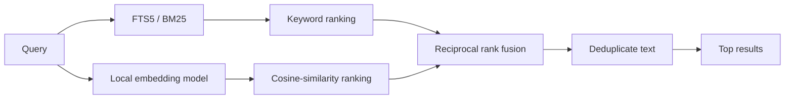

# Embeddings and hybrid search

Keyword search and semantic search answer different versions of “relevant.”
LocalLore runs both, then combines their rankings.

If these retrieval methods are new to you, start with
[Keyword and vector search](search-indexes.md), which explains inverted indexes,
embedding vectors, and how they differ.

## Embeddings

An embedding model maps text to a fixed-length numerical vector. Texts with
similar meaning tend to point in similar directions, even when they use
different words. LocalLore uses the image-bundled
`BAAI/bge-small-en-v1.5` model with 384-dimensional vectors by default.

Vectors are normalized and stored as float32 bytes in SQLite. At query time,
LocalLore embeds the query, normalizes it, and computes dot products against
stored vectors. For normalized vectors, this is cosine similarity.

## Keyword retrieval

SQLite FTS5 tokenizes message text and ranks matching rows with BM25. Keyword
retrieval is strong for exact identifiers, paths, error strings, and uncommon
terms.

## Reciprocal rank fusion

Raw BM25 and vector scores are not directly comparable. LocalLore instead uses
reciprocal rank fusion (RRF), which rewards a message according to its position
in either candidate list:

\[
\operatorname{score}(d) = \sum_{r \in R} \frac{1}{60 + r(d)}
\]

Here, \(r(d)\) is the one-based rank of document \(d\) in a retrieval list.
A result found by both methods receives contributions from both.

Filters for project, timestamp, role, and file path apply to both retrieval
branches. Each branch gathers four times the requested result limit before
fusion; the final output is capped at 25.
