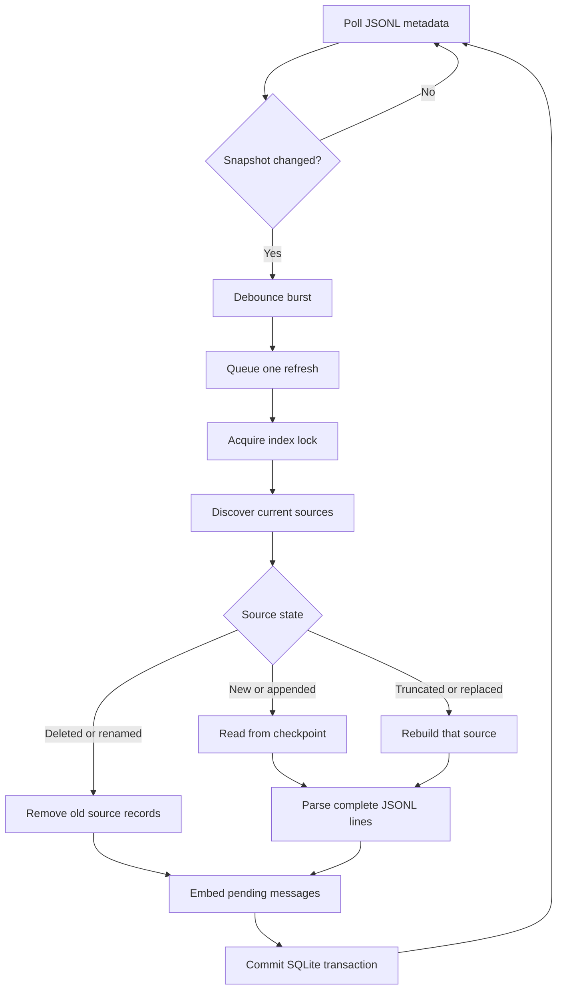

# Incremental indexing

Indexing converts append-oriented JSONL session files into structured,
searchable records. Re-reading every file on every change would waste work, so
LocalLore checkpoints each source by path, filesystem identity, size, modified
time, byte offset, and last complete line.

## Change handling

- **Unchanged file:** skip it using identity, size, and modification time.
- **Append:** seek to the stored byte offset and parse only new complete lines.
- **Incomplete tail:** leave the byte offset before the partial line so a later
  refresh can import it safely.
- **Truncation or replacement:** delete records associated with that source and
  rebuild it from byte zero.
- **Deletion or rename:** remove the missing source; foreign-key cascades clean
  up its messages, file operations, FTS rows, and embeddings. A renamed file is
  then discovered as new.
- **Malformed line:** record the error and continue with other lines.

Only one worker refreshes the index. File bursts coalesce through a debounce,
and refresh requests arriving during indexing queue another pass. Failures
retry with bounded exponential backoff.
