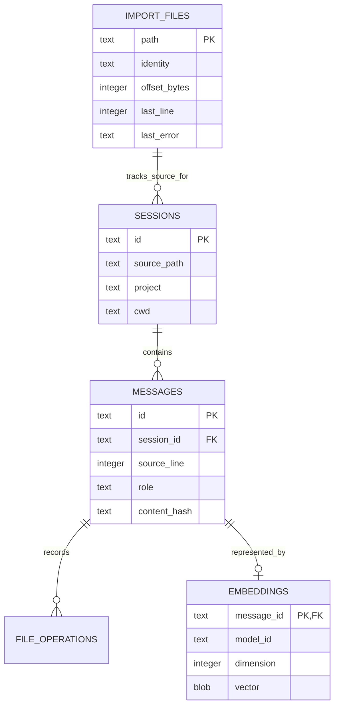

# Local storage and privacy

LocalLore stores two categories of data locally:

- **Source data:** Claude Code JSONL session history, bind-mounted read-only.
- **Derived data:** a SQLite database containing session metadata, plaintext
  messages, file-operation metadata, FTS5 rows, embedding vectors, and import
  checkpoints.

The schema also maintains an FTS5 virtual table synchronized with messages by
database triggers. Foreign keys cascade deletion from a session or message to
derived child records.

## Durability and concurrency

SQLite runs in WAL mode with foreign keys enabled and a 30-second busy timeout.
Readers see the most recent committed state during an indexing transaction.
The database is derived data: deleting its Docker volume removes LocalLore's
memory index, not the original Claude sessions.

## Security boundary

The container runs with a read-only filesystem as UID/GID 65532, drops Linux
capabilities, forbids privilege escalation, limits processes, and uses bounded
`noexec` temporary storage. Runtime model loading is local-files-only, and the
application has no telemetry, remote inference fallback, or arbitrary SQL tool.

The Compose bridge can technically provide outbound container networking;
Docker-level egress isolation is not claimed. The published MCP port is bound
to loopback and guarded against unexpected Host and Origin values.

!!! warning "Plaintext derived data"

    The SQLite volume contains conversation text and embeddings and is not
    encrypted by LocalLore. Use host disk encryption and operating-system
    access controls for protection at rest.
