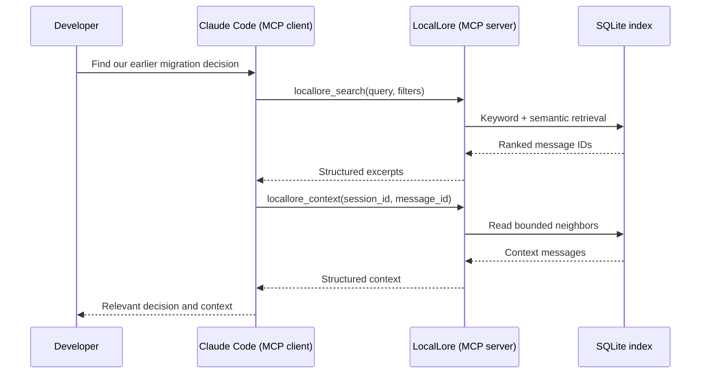

# Model Context Protocol (MCP)

The Model Context Protocol is a standard way for an AI application to discover
and invoke tools supplied by another process. In LocalLore, Claude Code is the
MCP client and the LocalLore daemon is the MCP server.

This separation matters because memory indexing should outlive an individual
chat. One daemon can keep the index current and serve multiple Claude sessions
without rebuilding a model or database for every client.

## LocalLore's MCP surface

LocalLore uses stateless Streamable HTTP at `/mcp` and returns JSON responses.
It exposes three tools:

- `locallore_status` reports index and background-runtime state.
- `locallore_search` performs hybrid retrieval with optional filters.
- `locallore_context` returns a bounded window around one result.

## Transport security

Docker publishes container port 8000 as host `127.0.0.1:8765`. FastMCP's
transport security accepts the expected loopback Host and Origin values to
reduce browser and DNS-rebinding risk. This is local isolation, not user
authentication: processes running as the current user are trusted.
