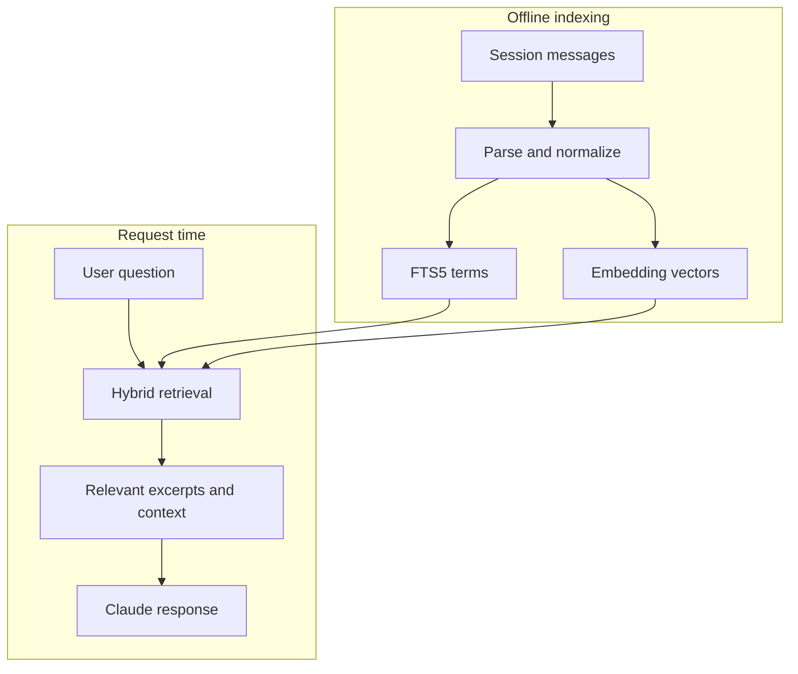

# RAG and LocalLore

Retrieval-augmented generation (RAG) gives a language model relevant external
information at request time. Instead of retraining the model on private data,
a retrieval system selects useful records and places them in the model's
working context.

LocalLore is a focused RAG system for prior Claude Code sessions:

1. **Ingest:** discover and parse Claude Code JSONL records.
2. **Represent:** store message text for keyword search and encode it as vectors
   for semantic search.
3. **Retrieve:** rank candidate messages for the current query.
4. **Augment:** return excerpts and optional neighboring messages through MCP.
5. **Generate:** Claude uses that retrieved evidence while answering the user.

LocalLore does not generate the final answer and it does not automatically add
every old message to every prompt. Its job is narrower: make likely-relevant
history cheaply discoverable, then let Claude request bounded context.

The retrieval step uses two complementary representations. Read
[Keyword and vector search](search-indexes.md) to learn how inverted indexes and
embedding vectors turn stored messages into searchable data.

Because both the corpus and embedding model remain local, the design trades
hosted-service scale for privacy, predictable operation, and a small deployment
surface.
