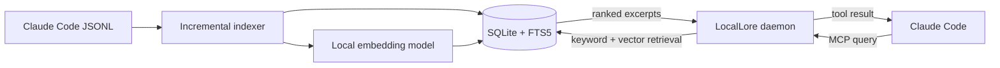

# LocalLore documentation

LocalLore gives Claude Code a private memory of earlier coding sessions. A
persistent local service incrementally indexes Claude's JSONL session history
and exposes keyword, semantic, and contextual retrieval through the Model
Context Protocol (MCP).

Everything needed for retrieval stays on your machine: the source sessions,
SQLite index, embedding model, and MCP endpoint. LocalLore does not send
conversation text to a hosted embedding or search service.

-   :material-rocket-launch:{ .lg .middle } **Start with a working search**

    ---

    Install LocalLore, verify the daemon, and retrieve your first memory.

    [:octicons-arrow-right-24: First-search tutorial](tutorials/first-search.md)

-   :material-tools:{ .lg .middle } **Complete a task**

    ---

    Find operational recipes for installation, search, and troubleshooting.

    [:octicons-arrow-right-24: How-to guides](how-to/install-and-operate.md)

-   :material-lightbulb-on:{ .lg .middle } **Understand the design**

    ---

    Learn MCP, RAG, embeddings, indexing, hybrid search, and local storage.

    [:octicons-arrow-right-24: Architecture](explanation/architecture.md)

-   :material-code-braces:{ .lg .middle } **Look up exact details**

    ---

    Check settings, interfaces, and generated Python API documentation.

    [:octicons-arrow-right-24: Reference](reference/configuration.md)

## How a memory becomes a result

The documentation follows the [Diátaxis](https://diataxis.fr/) model:
tutorials teach through a guided experience, how-to guides solve specific
tasks, explanations build understanding, and reference pages provide precise
technical facts.

!!! note "Project status"

    This repository is a finished, pinned snapshot and is not actively
    maintained. Review its locked dependencies and security assumptions before
    adopting it.
